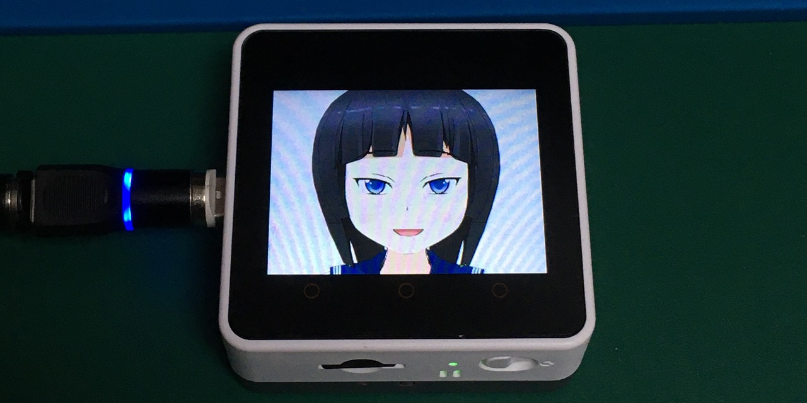
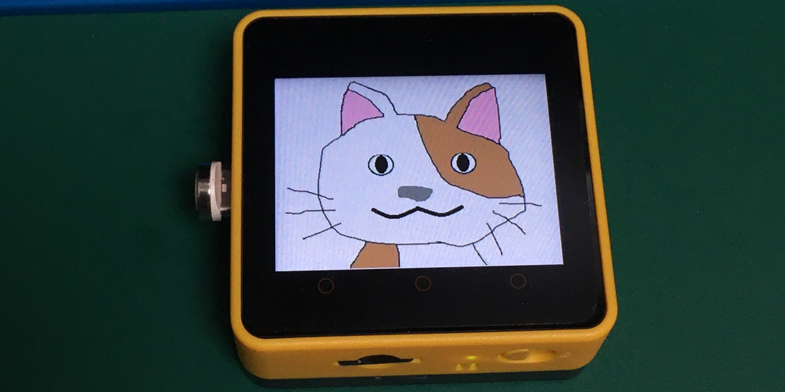

# M5Core2-Image-Avatar(beta version)
 M5Stack Image Avatar for M5Stack Core2




日本語 | [English](README_en.md)

# 注意

　M5Stack Image AvatarはSpriteの拡大縮小・回転機能を利用しているため[LovyanGFXライブラリ](https://github.com/lovyan03/LovyanGFX)が必要です。（M5Stackライブラリには拡大縮小機能がありません。）


# 概要(Overview)

　あらかじめ用意した画像ファイル（BMP）を組み合わせてAvatarを作成できるアプリです。[AquesTalk for ESP32](https://www.a-quest.com/products/aquestalk_esp32.html)と組み合わせて言葉を喋ることもできます。

# 開発環境(Environment)
- VSCode
- PlatformIO

## 必要なライブラリ
- [LovyanGFX](https://github.com/lovyan03/LovyanGFX)

## AquesTalkのインストール
[AquesTalk for ESP32](https://www.a-quest.com/products/aquestalk_esp32.html)に従ってインストールしてください。<br>
AquesTalkのインストールが難しい方はM5StackImageAvatar.inoの先頭にある#define USE_TTSをコメントアウトしてください。<br>

# 対応機種
- M5Stack Core2

## その他の機種
- M5Stack FireはPSRAMがあるので動く可能性があります。
- それ以外のM5Stackシリーズはカラーパレットを共通にして8bitまたは4bitビットマップで表現すれば動作は可能ですが、パーツとデータの用意が非常に煩雑になるため今回は対応外とします。

# 使い方
SDカードのルートに「data」フォルダ配下にあるフォルダをコピーしてください<br>
使用したいアバターモデルのavatarconfig.hをsrcフォルダに上書きコピーしてビルドします。<br>

- ボタンA：Avatarが動きます。
- ボタンB：目玉が左右に動きます。
- ボタンC：感情が変わります。

## Avatarモデル
下記の3種類あります。
- [五積ほむら](data/bmp_homura/)

- [五積あい](data/bmp_ai/)

- [さいぞう](data/bmp_saizou/)<br>さいぞうは[robo8080](https://github.com/robo8080)さんのデザインをお借りして復元しました。


# 画像の準備
表情を豊かにするためにAvatarの部品を7つ用意する必要があります。

## 画像パーツを作成する場合に注意する点
オリジナルのImageAvatarを作成するためには部品となるBMP画像ファイルが必要です。

## 画像作成で使用したツール
- [コミPo!](https://www.comipo.com/)<br>五積ほむら・五積あいの元データ作成で利用しました。
- [GIMP](https://www.gimp.org/)<br>パーツの作成で使用しました。

### 透明色と肌色
部品の重ね合わせを利用するために予め透明色１と透明色２を決めます。

五積ほむらの場合、透明色１（緑：0x00FF00U）,透明色２（青：0x0000FFU）

### 回転のためのマージン
萌え軸を利用する場合、Spriteのマージンが必要なので元画像は傾けても大丈夫な大きさで作成します。


## 必要なパーツ
- 固定パーツ1（１パターン用意する）
1. 頭部<br>（顔部分は肌色で塗る、ボディーパーツと重なる部分は透明色）
1. 首と胴体部<br>（頭部と重なる部分は透明色）
- 固定パーツ2（感情の数だけ用意する）
1. 目玉<br>黒目以外は目玉の色で塗る
1. 眉毛<br>右だけ用意します。

- 状態が変化するパーツ（開閉ｘ感情の数だけ用意する）
1. 開いたまぶた<br>右だけ用意します。（周りは透明色２、まぶたの中は透明色１）
1. 閉じたまぶた<br>右だけ用意します。（周りは透明色２）
1. 開いた口<br>口の周りは透明色１
1. 閉じた口<br>口の周りは透明色１

まぶたと口は開いた状態と閉じた状態を同じ大きさで用意します。

### 感情を表現したい場合
感情を表現したいときは固定パーツ（頭部、胴体部）を除くパーツを用意すればBMPファイルを入れ替えることによって切り替えが可能です。

五積ほむらは普通・笑う・恥ずかしい・驚く・眠いの５つの状態をボタンCを押すことにより切り替え可能なので参考にしてください。


# オプション機能
オプション機能については以下の３つがありそれぞれM5StackImageAvatar.inoの#defineで切り替えます。(必要ない場合はコメントアウトする。)
```
#define USE_TTS     // AquesTalk is necessary.(https://www.a-quest.com/products/aquestalk_esp32.html)
#define USE_MIC     // M5Go Bottom's MIC is necessary.
#define USE_WIFI    // M5StackFire is required when using 8bit color.Because Gray and Basic don't have enough memory.

```
- USE_TTS<br>音声合成を利用する。(AquesTalk for ESP32のインストールが必要)
- USE_MIC<br>GoボトムについているMICに合わせてlipsyncします。
- USE_WIFI<br>現在は接続するだけで特に機能は実装していません。メモリを80K程度消費するのでOut Of Memoryに注意してください。4bitBMPでAvatarを作成するかM5Stack Fireを推奨します。

## 設定ファイル
- [src/colorpalette.h](src/colopalette.h)<br>画像共通のカラーパレット情報を設定します。（16,24bitの場合は未使用）
- [src/avatarconfig.h](src/avatarconfig.h)<br>Avatarのパラメータ、各画像ファイルの位置、大きさ、角度等を設定します。
# 参考にしたリポジトリ
- [m5stack-avatar](https://github.com/meganetaaan/m5stack-avatar)
- [M5Stack_WebRadio_Avator](https://github.com/robo8080/M5Stack_WebRadio_Avator)
- [M5StackFire用サンプル M5StackFire_MicrophoneSpectrumTFT](https://github.com/m5stack/M5Stack/tree/master/examples/Fire/M5StackFire_MicrophoneSpectrumTFT)

# 謝辞
このソフトを作成するにあたり、動きや構造の元となった[M5Stack-Avatar](https://github.com/meganetaaan/m5stack-avatar)を作成・公開してくださった[meganetaaan](https://github.com/meganetaaan)氏に感謝いたします。

ImageAvatarを実現するにあたり優れたパフォーマンス、機能を持ったLovyanGFXの作者[lovyan03](https://github.com/lovyan03)氏に感謝いたします。

五積ほむらを作成するにあたり、 初期の頃からたくさんのアドバイスを頂き、参考にさせていただいた[M5Stack_WebRadio_Avatar](https://github.com/robo8080/M5Stack_WebRadio_Avator)の作者[robo8080](https://github.com/robo8080)氏に感謝いたします。


# Credit
- [meganetaaan](https://github.com/meganetaaan)
- [lovyan03](https://github.com/lovyan03/LovyanGFX)
- [robo8080](https://github.com/robo8080)

# LICENSE
[MIT](LICENSE)

# Author
[Takao Akaki](https://github.com/mongonta0716)

