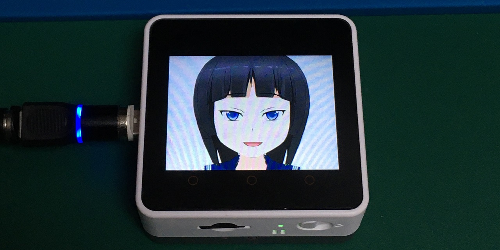
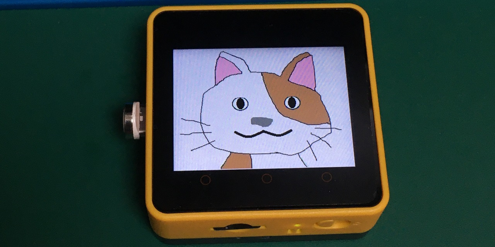

# M5Core2-Image-Avatar(beta version)
M5Stack Image Avatar for M5Stack Core2




[日本語](README.md)｜English

# Notice
 The M5Stack Image Avatar uses the scaling and rotation functions of Sprite, so the [LovyanGFX library](https://github.com/lovyan03/LovyanGFX) is required. (The M5Stack library does not have a scaling function.


# Overview
 This application allows you to create an Avatar by combining pre-prepared image files (BMP). You can also combine it with [AquesTalk for ESP32](https://www.a-quest.com/products/aquestalk_esp32.html) to speak words.

 AquesTalk is for Japanese Only.

# Environment
- VSCode
- PlatformIO

## Requirement
- [LovyanGFX](https://github.com/lovyan03/LovyanGFX)

# Supported models
- M5Stack Core2

## Other models
- The M5Stack Fire may work because it has PSRAM.
- Other M5Stack series can work if they share the same color palette and use 8-bit or 4-bit bitmaps, but it will be very complicated to prepare the parts and data.

# Usage
Copy the folder under the "data" folder to the root of the SD card<br>.
Copy the avatarconfig.h file of the avatar model you want to use to the src folder and build it. <BR>

- Button A: The avatar will move.
- Button B: The eyeballs will move left and right.
- Button C: Emotions will change.

## Avatar models
There are three types as follows.
- [Homura Gotumi](data/bmp_homura/)

- [Ai Gotsumi](data/bmp_ai/)

- [Saizou](data/bmp_saizou/)<br>Saizou was restored by borrowing the design of [robo8080](https://github.com/robo8080).


# Image preparation
We need to prepare 7 parts of Avatar to enrich the facial expressions.

## Points to be noted when creating image parts
In order to create an original ImageAvatar, you need a BMP image file as a component.

## Tools used for image creation
- [ComiPo!](https://www.comipo.com/)<br>I used it to create the original data of Homura Gotsumi and Ai Gotumi.
- [GIMP](https://www.gimp.org/)<br>Used in creating the parts.

### Transparent Colors and Skin Tones
Decide the transparent color 1 and transparent color 2 beforehand in order to use the overlapping of parts.

In the case of Goshaku Homura, transparent color 1 (green: 0x00FF00U), transparent color 2 (blue: 0x0000FFU)

### Margin for rotation
If you want to use the moe axis, you will need a margin for Sprite, so make the original image large enough to be tilted.


## Required Parts
- Fixed Parts 1 (prepare one pattern)
1. head<br>(paint the face part in skin color, the part overlapping the body part in transparent color)
1. neck and torso<br> (transparent color for the parts that overlap with the head)
- Fixed parts 2 (prepare as many as the number of emotions)
Eyeballs<br>Unless the eyes are black, paint them the color of the eyeballs.
1. eyebrows<br>Prepare only the right side.

- Parts that change state (open/close x number of emotions to be prepared)
1. open eyelid<br>Prepare only the right eyelid. 1. open eyelid<br>Prepare only the right eyelid. (2 transparent colors around, 1 transparent color inside the eyelid)
1. closed eyelid<br>Only the right eyelid should be prepared. 1.
1. open mouth<br>Transparent color around the mouth.
Closed mouth<br>Transparent color around mouth1

Prepare the eyelids and mouth in the same size, open and closed.

### When you want to express emotion.
If you want to express emotions, prepare the parts except for the fixed parts (head and torso), and you can switch between them by replacing the BMP files.

Goshaku Homura can switch between 5 states (normal, laughing, embarrassed, surprised, sleepy) by pressing button C, so please refer to that.


# Optional Functions
There are three optional functions, which can be switched by #define in M5StackImageAvatar.ino. (Comment them out if you don't need them.)
```
#define USE_TTS // AquesTalk is necessary.(https://www.a-quest.com/products/aquestalk_esp32.html)
#define USE_WIFI // M5StackFire is required when using 8bit color.Because Gray and Basic don't have enough memory.
```

Because Gray and Basic don't have enough memory.
- USE_TTS<br>Use text-to-speech. (Requires installation of AquesTalk for ESP32).
- USE_WIFI<br>Currently, we are just connecting and not implementing any special functions. USE_WIFI<br>Now it just connects, no special function is implemented. 80K memory is consumed, so be careful with Out Of Memory. 4bitBMP Avatar or M5Stack Fire is recommended.

## Configuration file
- [src/colorpalette.h](src/colopalette.h)<br>Set the color palette information common to all images. (Not used for 16 and 24 bit images.)
- [src/avatarconfig.h](src/avatarconfig.h)<br>Set parameters of Avatar, position, size, angle, etc. for each image file.
# Reference repository.
- [m5stack-avatar](https://github.com/meganetaaan/m5stack-avatar)
- [M5Stack_WebRadio_Avator](https://github.com/robo8080/M5Stack_WebRadio_Avator)
- [Sample for M5StackFire M5StackFire_MicrophoneSpectrumTFT](https://github.com/m5stack/M5Stack/tree/master/examples/Fire/M5StackFire_ MicrophoneSpectrumTFT)

# Acknowledgements
I would like to thank [meganetaaan](https://github) for creating and releasing [M5Stack-Avatar](https://github.com/meganetaaan/m5stack-avatar), which was the source of the movement and structure of this software. .com/meganetaaan).

I would like to thank [lovyan03](https://github.com/lovyan03), the author of LovyanGFX, for its excellent performance and features in realizing ImageAvatar.

I would like to thank [M5Stack_WebRadio_Avatar](https://github.com/robo8080/M5Stack_WebRadio_Avator) author [robo8080](https://github.com/robo8080/M5Stack_WebRadio_Avator) who gave me a lot of advices and references in the early days of creating Goshaku Homura. M5Stack_WebRadio_Avatar](https://github.com/robo8080), who gave me a lot of advice and references in the early days.


# Credit
- [meganetaaan](https://github.com/meganetaaan)
- [lovyan03](https://github.com/lovyan03/LovyanGFX)
- [robo8080](https://github.com/robo8080)

# LICENSE
[MIT](LICENSE)

# Author
[Takao Akaki](https://github.com/mongonta0716)


